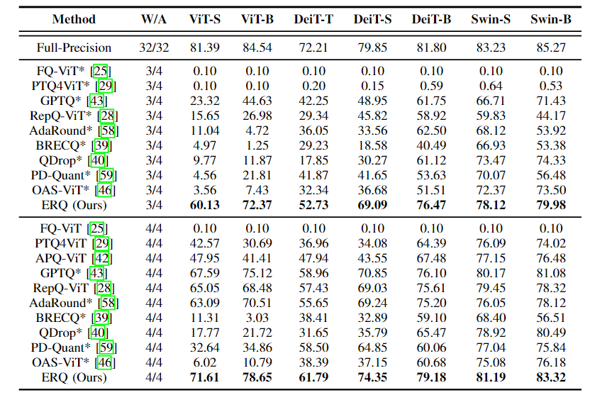

## Towards Accurate Post-Training Quantization of Vision Transformers via Error Reduction (ERQ)

Below are instructions for reproducing the classification results of ERQ. Note that this paper is **extended** from our previous ICML2024 paper:

ERQ: Error Reduction for Post-Training Quantization of Vision Transformers (**spotlight**).

Note that we also provide the instructions for reproducing the detection/SR results of ERQ in ERQ_detection.zip/ERQ_SR.zip

## Environment Setup

You can run `bash env_setup.sh` to configure the environment automatically.

## Evaluation

- First, create a fold for save the fp output:

```bash
cd /path-to-code & mkdir fp_output
```

- Then, you can quantize and evaluate a single model using the following command:

```bash
python test_quant_expand.py [--model] [--dataset] [--w_bit] [--a_bit] [--coe] [--calib-batchsize]

optional arguments:
--model: Model architecture, the choises can be: 
    vit_small, vit_base, deit_tiny, deit_small, deit_base, swin_tiny, swin_small.
--dataset: Path to ImageNet dataset.
--w_bit: Bit-precision of weights.
--a_bit: Bit-precision of activation.
--coe: Parameter of \lambda_1 and \lambda_2.
--calib-batchsize: Number of calibration dataset.
```

- Example: Quantize *DeiT-S* at W4/A4 precision:

```bash
CUDA_VISIBLE_DEVICES=0 python test_quant.py --model deit_small --dataset /data/datasets/ImageNet --w_bit 4 --a_bit 4--calib-batchsize 32 --coe 10000
```

## Benchmark

### Linear Module Benchmark

- You can simply run above command to benchmark the performance of Linear module(for FP32, 8bit, and 4bit mode)

  ```
  export PYTHONPATH=./
  python benchmark/module_benchmark.py --bsz=<BatchSize> --seq_len=<SequenceLength> --layer_type=<LayerType>
  ```
- The `LayerType` can be `v_proj` or `down_proj`.

### Full Vit Model Benchmark

- You can simply run above command to benchmark the performance of Linear module(for FP32, 8bit, and 4bit mode)

  ```
  export PYTHONPATH=./
  python benchmark/vit_benchmark.py --model=<ModelType> --val-batchsize=<ValBatchSize>
  ```

## Results

Below are the part of classification results on ImageNet dataset.


## Citation

This code and paper is **extended** from our previous ICML2024 paper:

ERQ: Error Reduction for Post-Training Quantization of Vision Transformers (**spotlight**).

We highly appreciate it if you would please cite the following paper if our work is useful for your work:

```bash
@inproceedings{zhongerq,
  title={ERQ: Error Reduction for Post-Training Quantization of Vision Transformers},
  author={Zhong, Yunshan and Hu, Jiawei and Huang, You and Zhang, Yuxin and Ji, Rongrong},
  booktitle={Proceedings of the International Conference on Machine Learning (ICML)},
  year={2024}
}
```

## Acknowledge

Our code is heavily based on the code of RepQ-ViT. We highly appreciate their work.

```bash
@article{li2022repqvit,
  title={RepQ-ViT: Scale Reparameterization for Post-Training Quantization of Vision Transformers},
  author={Li, Zhikai and Xiao, Junrui and Yang, Lianwei and Gu, Qingyi},
  journal={arXiv preprint arXiv:2212.08254},
  year={2022}
}
```
